# Sequence Diagram

## 1. Purpose

This document describes the runtime sequence of the Job Search Automation system from scheduling through provider collection, normalization, enrichment, candidate matching, scoring, final selection, and Google Sheets export.

The production application follows this overall flow:

```text
n8n
  |
  v
FastAPI
  |
  v
SearchPipeline
  |
  v
SearchOrchestrator
  |
  v
Provider Layer
  |
  v
Canonical Jobs
  |
  v
Deduplication
  |
  v
Freshness Filtering
  |
  v
Enrichment
  |
  v
Resume Matching
  |
  v
Ranking
  |
  v
Final Selection
  |
  v
Google Sheets
```

---

## 2. Production End-to-End Sequence

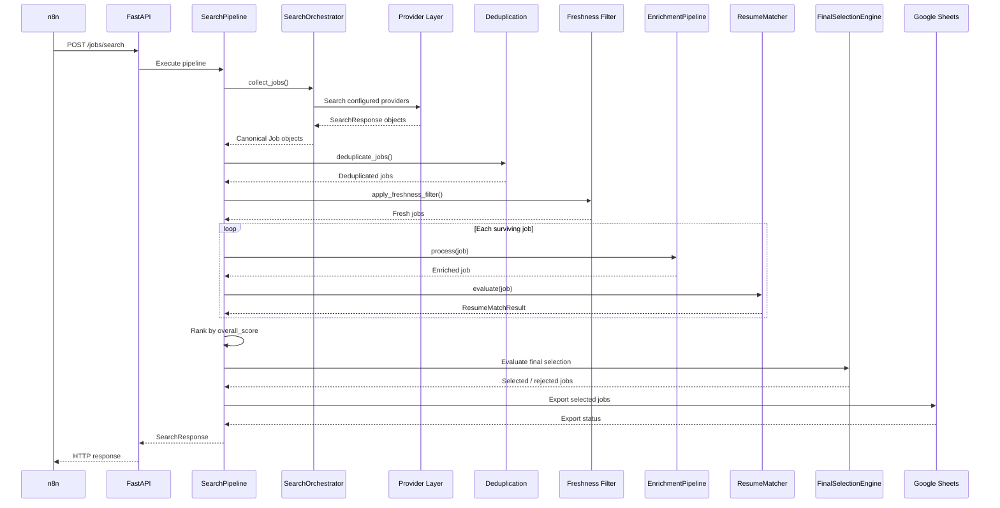

---

## 3. Scheduling and API Boundary

n8n is responsible for scheduling and triggering the Python application.

Python owns the job-search business logic.

```text
n8n
 |
 | Scheduled trigger
 v
POST /jobs/search
 |
 v
FastAPI
 |
 v
SearchPipeline
```

The local API endpoint is:

```text
http://127.0.0.1:8000/jobs/search
```

The health endpoint is:

```text
http://127.0.0.1:8000/health
```

The responsibility split is:

```text
n8n
 |
 +--> Scheduling
 +--> Workflow triggering
 +--> HTTP invocation
 +--> Workflow orchestration

Python Application
 |
 +--> Provider collection
 +--> Normalization
 +--> Deduplication
 +--> Freshness filtering
 +--> Enrichment
 +--> Resume matching
 +--> Scoring
 +--> Ranking
 +--> Final selection
 +--> Google Sheets export
```

n8n should not duplicate the Python application's business logic.

---

## 4. Provider Collection Sequence

The `SearchPipeline` delegates job collection to `SearchOrchestrator`.

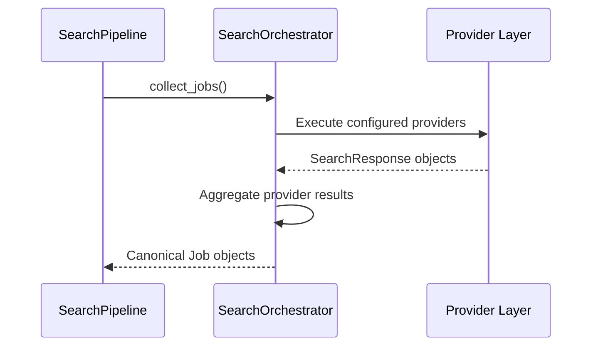

The provider layer can include:

```text
RapidAPI / JSearch
Jooble
Adzuna
Remotive
Apify
Google Jobs
JobSpy
Greenhouse
Lever
Ashby
Workday
SmartRecruiters
BambooHR
```

---

## 5. Single Provider Sequence

Every provider follows the same conceptual boundary:

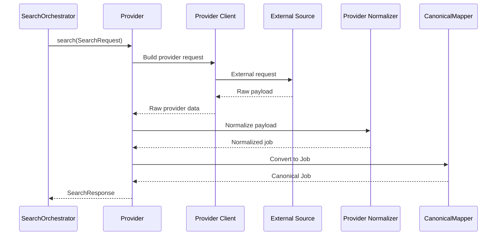

The provider boundary is therefore:

```text
External Source
      |
      v
Provider Client
      |
      v
Raw Payload
      |
      v
Normalizer
      |
      v
CanonicalMapper
      |
      v
Job
```

Downstream stages should consume `Job`, not provider-specific JSON.

---

## 6. RapidAPI Sequence

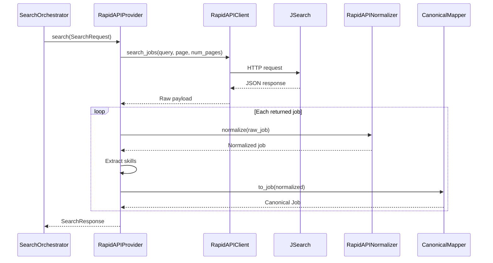

---

## 7. Apify Sequence

```mermaid
sequenceDiagram

    participant ORCH as SearchOrchestrator
    participant APIFY as ApifyProvider
    participant CLIENT as ApifyClient
    participant ACTOR as Apify Actor
    participant NORM as ApifyNormalizer
    participant MAP as CanonicalMapper

    ORCH->>APIFY: search(SearchRequest)

    APIFY->>CLIENT: search_jobs(query, location, max_items)

    CLIENT->>ACTOR: Execute actor / retrieve results

    ACTOR-->>CLIENT: Raw jobs

    CLIENT-->>APIFY: Raw payload

    loop Each returned job
        APIFY->>NORM: normalize(raw)
        NORM-->>APIFY: Normalized job

        APIFY->>MAP: to_job(normalized)
        MAP-->>APIFY: Canonical Job
    end

    APIFY-->>ORCH: SearchResponse
```

### Apify URL validation

The Apify normalizer must distinguish between a real direct job/application URL and an unusable URL.

```text
Valid direct job URL
        |
        v
Accept
```

```text
Google Jobs search URL
        |
        v
Reject as application URL
```

```text
Placeholder URL
        |
        v
Reject as application URL
```

The system must not manufacture a direct application URL when the provider did not supply a valid one.

---

## 8. ATS Provider Sequence

ATS providers retrieve jobs from employer applicant-tracking systems.

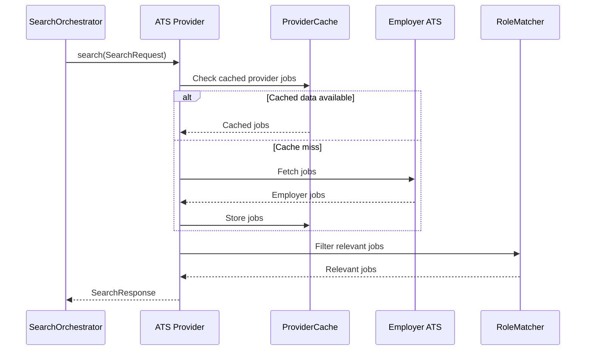

ATS filtering may use:

```text
role
keywords
location
remote eligibility
analytics relevance
business intelligence relevance
```

---

## 9. Provider Failure Isolation

A provider failure should not automatically terminate the entire search.

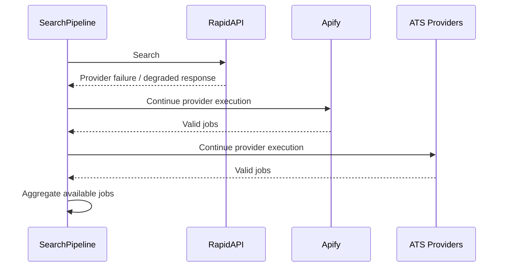

Example:

```text
RapidAPI
    -> DEGRADED

Apify
    -> SUCCESS

ATS Providers
    -> SUCCESS
```

The orchestration layer should preserve successful results from available providers wherever safe.

---

## 10. Deduplication Sequence

After provider collection, duplicate opportunities are removed.

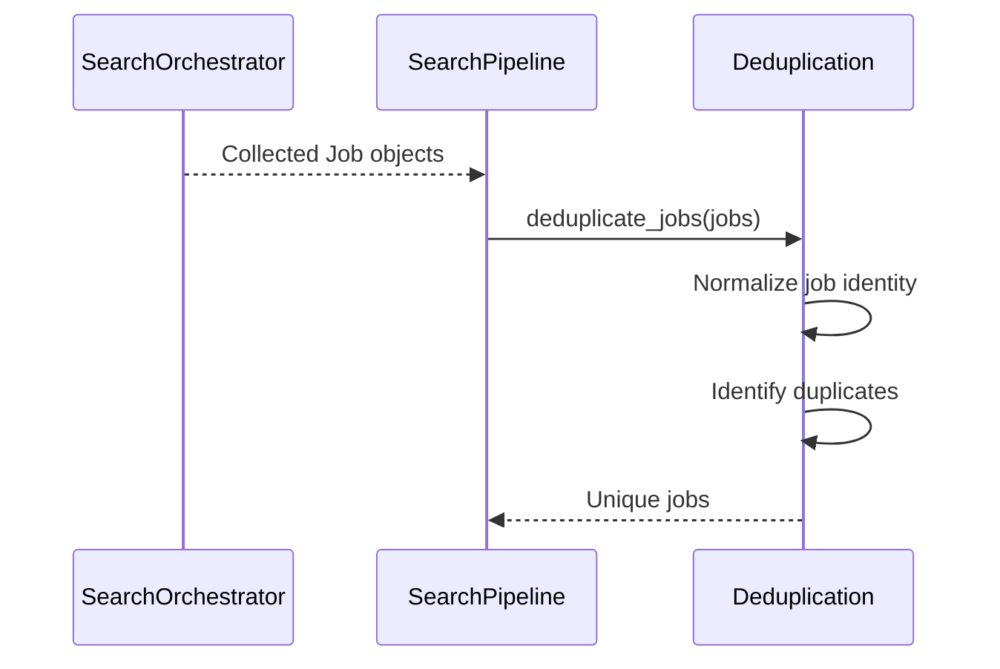

Deduplication occurs before expensive enrichment and intelligence processing.

---

## 11. Freshness Sequence

The freshness filter removes stale job postings.

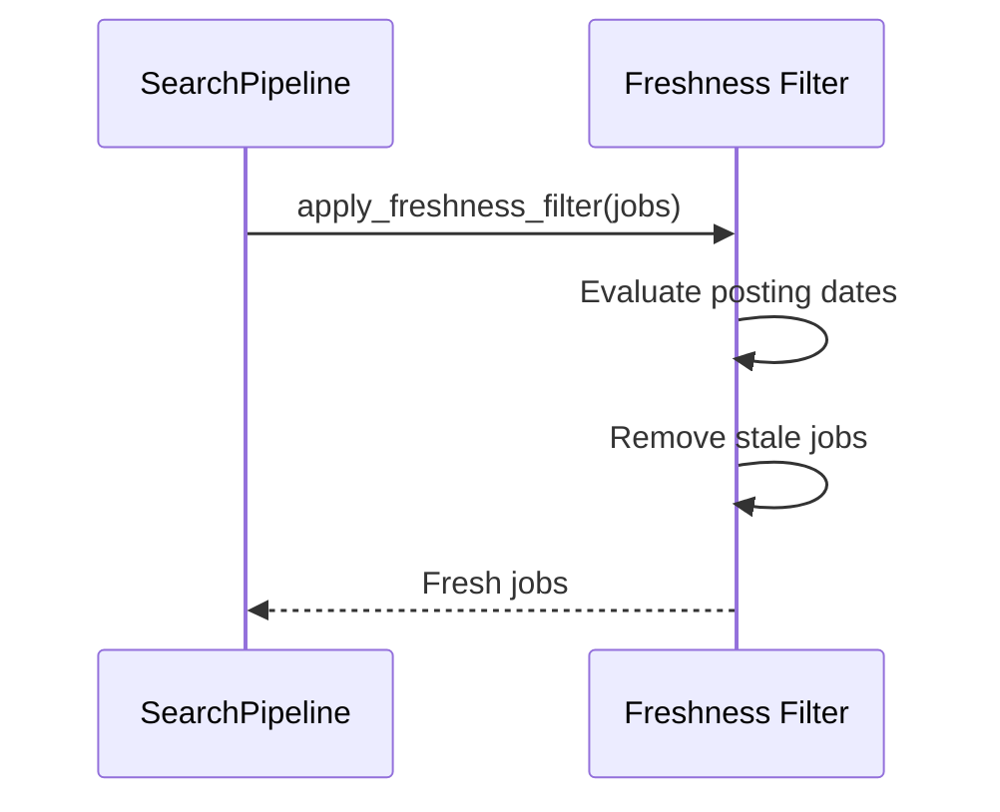

The documented production rule removes jobs outside the configured freshness window.

---

## 12. Enrichment Sequence

The enrichment pipeline adds deterministic job metadata before candidate matching.

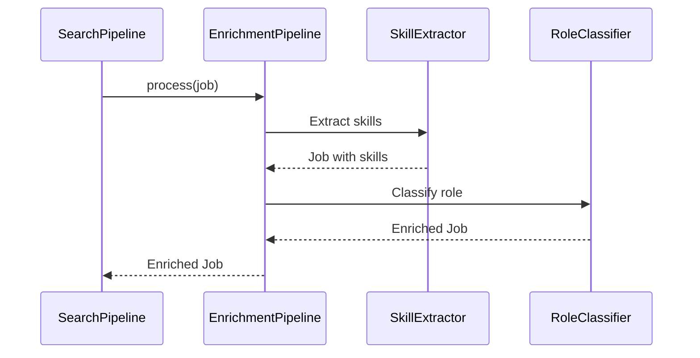

The enrichment stage includes deterministic operations such as:

```text
Skill extraction
Role classification
Job-family classification
Seniority classification
```

---

## 13. Resume Matching Sequence

The `ResumeMatcher` evaluates each surviving job against the candidate profile.

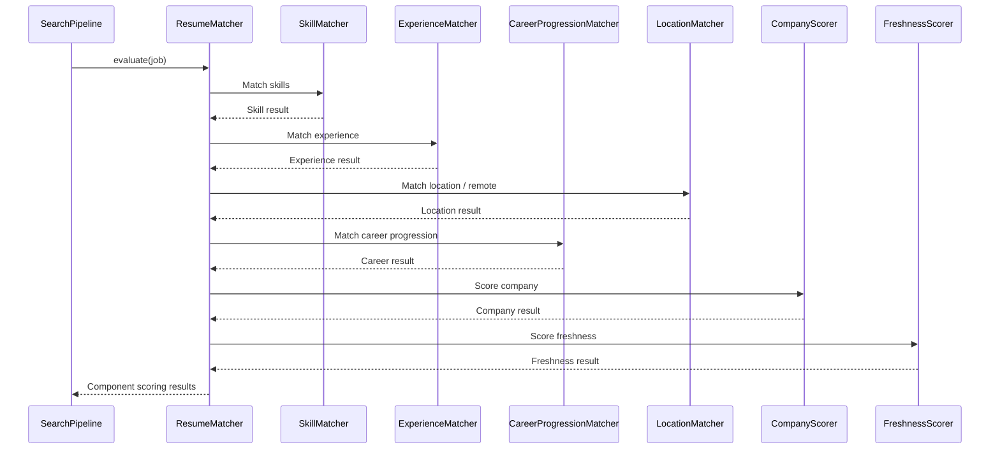

---

## 14. Weighted Score Calculation

The final deterministic score is calculated from the six scoring components:

```text
Skill Match
Experience Match
Career Progression
Location Match
Company Score
Freshness Score
```

The current weights are:

```text
Skills              30%
Experience          20%
Career progression  15%
Location            10%
Company             10%
Freshness           15%
                    ----
                    100%
```

The scoring sequence is:

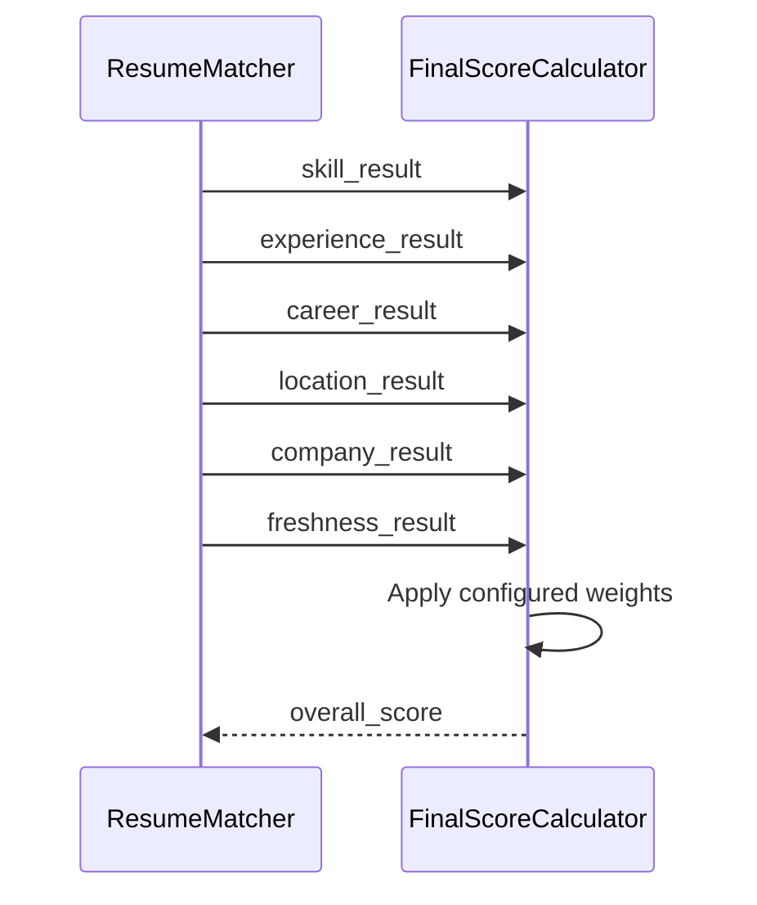

The deterministic score remains the authoritative job/candidate score.

---

## 15. Gemini Enrichment Sequence

Gemini enrichment is supplementary to deterministic scoring.

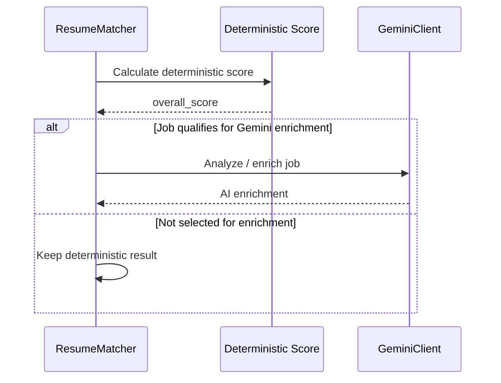

The deterministic score is not replaced by Gemini output.

Gemini can provide additional information such as:

```text
job analysis
resume tailoring
cover letter generation
interview preparation
```

---

## 16. Ranking Sequence

After evaluation, jobs are ranked by the deterministic overall score.

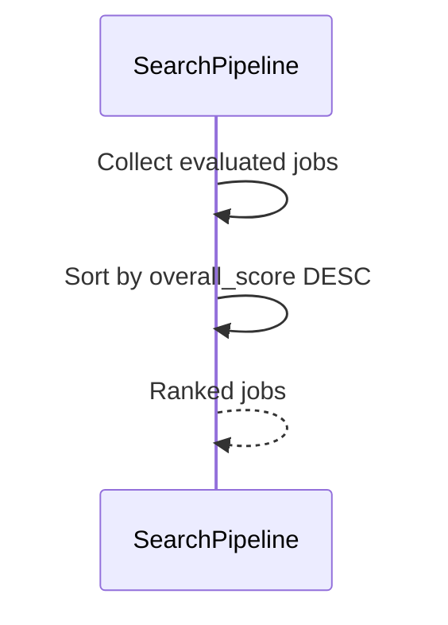

The ranking stage therefore operates after enrichment and resume matching.

---

## 17. Final Selection Sequence

`FinalSelectionEngine` is responsible for deciding which evaluated jobs belong in the final application queue.

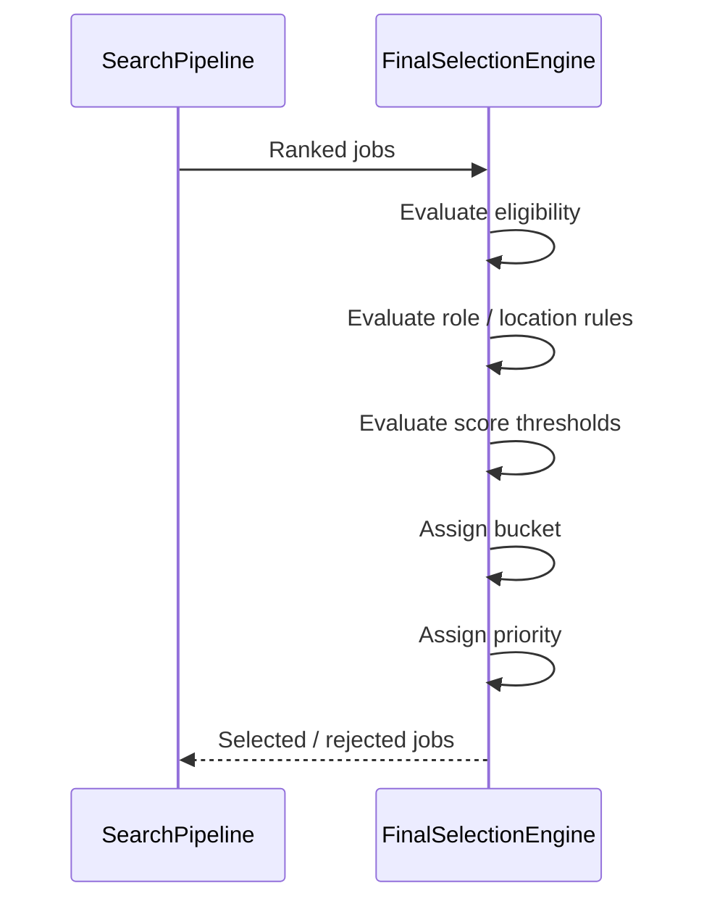

The final decision includes fields such as:

```text
final_selection_eligible
final_selection_bucket
final_selection_reason
final_selection_priority
```

---

## 18. Application Queue Boundary

The search pipeline prepares the final application queue.

```text
Ranked Jobs
     |
     v
FinalSelectionEngine
     |
     +------------------+
     |                  |
     v                  v
Eligible             Rejected
     |
     v
Application Queue
```

The application execution layer remains downstream of discovery and scoring.

The system should therefore distinguish:

```text
Job discovery
```

from:

```text
Application execution
```

---

## 19. Google Sheets Export Sequence

Selected jobs are mapped to rows and exported to Google Sheets.

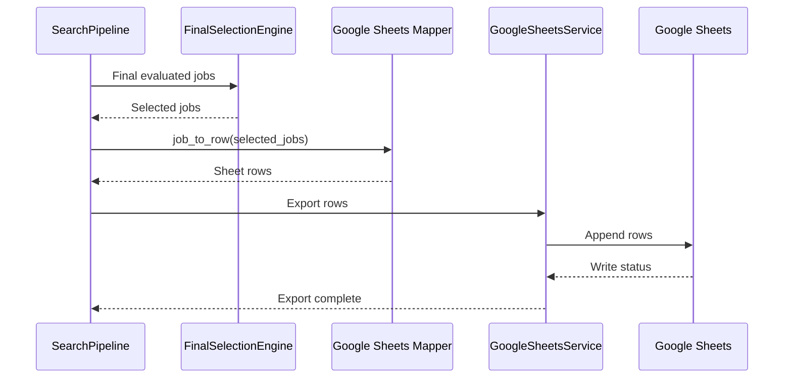

Google Sheets acts as the current reporting and tracking destination for the selected jobs.

---

## 20. Complete Production Sequence

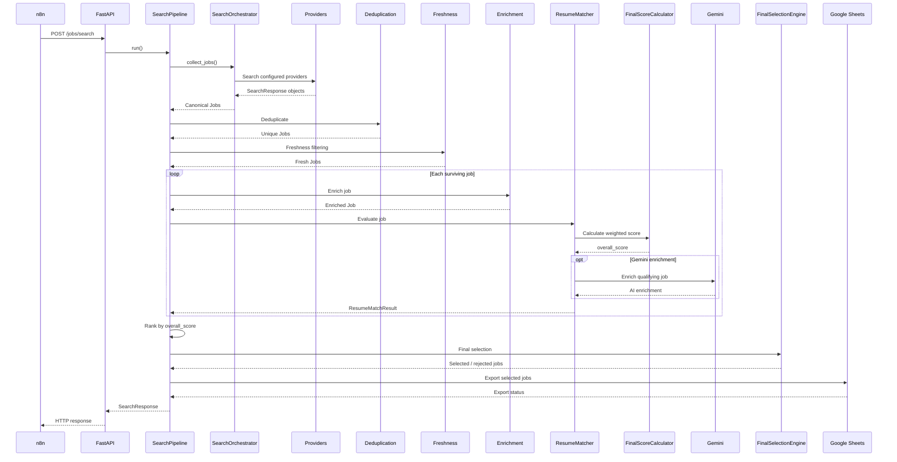

---

## 21. Responsibility Boundaries

### n8n

```text
Scheduling
Workflow triggering
HTTP invocation
Workflow orchestration
```

### FastAPI

```text
HTTP endpoint
Request handling
Pipeline invocation
Response handling
```

### SearchPipeline

```text
End-to-end orchestration
Stage ordering
Pipeline coordination
```

### SearchOrchestrator

```text
Provider execution
Provider result aggregation
Canonical job collection
```

### Providers

```text
External job acquisition
Provider-specific handling
Normalization
Canonical Job creation
```

### EnrichmentPipeline

```text
Skill extraction
Role classification
Deterministic enrichment
```

### ResumeMatcher

```text
Skill matching
Experience matching
Career progression
Location scoring
Company scoring
Freshness scoring
Final weighted score
Optional Gemini enrichment
```

### FinalSelectionEngine

```text
Eligibility
Final bucket
Final reason
Final priority
```

### GoogleSheetsService

```text
Selected-job export
Pipeline audit export
```

---

## 22. Local Runtime Boundary

The currently validated deployment runs locally:

```text
Windows Machine
      |
      +--> Python virtual environment
      |
      +--> FastAPI
      |
      +--> n8n
      |
      +--> External provider access
      |
      +--> Google Sheets credentials
      |
      +--> Gemini credentials
```

The local API boundary is:

```text
n8n
 |
 v
127.0.0.1:8000
 |
 v
FastAPI
```

This means the current deployment is a local production-style workflow and not yet an always-on public cloud deployment.

---

## 23. Core Architectural Sequence

The most important system boundary is:

```text
External Providers
        |
        v
Provider Layer
        |
        v
Canonical Job
        |
        v
Core Search Pipeline
        |
        +--> Deduplication
        +--> Freshness
        +--> Enrichment
        +--> Resume Matching
        +--> Weighted Scoring
        +--> Ranking
        +--> Final Selection
        |
        v
Application Queue
        |
        v
Google Sheets / Downstream Workflow
```

The architecture keeps the following concerns separate:

```text
Provider acquisition
        !=
Candidate scoring
        !=
Final selection
        !=
Application execution
        !=
Scheduling
```

This separation allows each layer to be tested and changed independently.

---

## 24. Final Sequence Summary

```text
n8n Schedule
      |
      v
FastAPI
      |
      v
SearchPipeline
      |
      v
SearchOrchestrator
      |
      v
Providers
      |
      v
Canonical Job
      |
      v
Deduplication
      |
      v
Freshness Filtering
      |
      v
Deterministic Enrichment
      |
      v
ResumeMatcher
      |
      +--> Skill Match
      +--> Experience Match
      +--> Career Progression
      +--> Location
      +--> Company
      +--> Freshness
      |
      v
FinalScoreCalculator
      |
      v
Optional Gemini Enrichment
      |
      v
Ranking
      |
      v
FinalSelectionEngine
      |
      v
Application Queue
      |
      v
Google Sheets
      |
      v
SearchResponse
      |
      v
FastAPI
      |
      v
n8n
```

The central principle is:

```text
External-source complexity
        |
        v
Provider Boundary
        |
        v
Canonical Job
        |
        v
Deterministic Business Logic
        |
        v
Final Selection
        |
        v
Downstream Application Workflow
```
